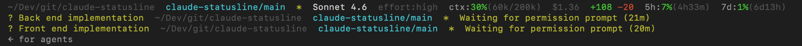

# claude-statusline

A custom status line for [Claude Code CLI](https://claude.ai/code) that shows working directory, git repo/branch, model, context window usage, and rate limit usage with reset countdowns.



```
~/Dev/github/my-repo  my-repo/main  *  +2  Sonnet 4.6  effort:high  ctx:60%(119k/200k)  $3.94  +416 -118  5h:74%(4h32m)  7d:39%(2d18h)
? AR sync implementation  ~/Dev/github/my-repo  my-repo/feat/auth  *  Waiting for permission prompt (21m)
> Other busy session  ~/Dev/github/other-repo  other-repo/main  3m ago
```

## What it shows

**Line 1**

| Segment | Description |
|---|---|
| `~/Dev/github/my-repo` | Current working directory (`~` for home) |
| `my-repo/main` | Git repo name and current branch |
| `*` | Uncommitted changes (modified, staged, or untracked files) |
| `+N` / `-N` | Commits ahead / behind remote tracking branch |
| `~N` | Stash entries |
| `Sonnet 4.6` | Active model |
| `effort:high` | Effort level when non-default (dim) |
| `ctx:60%(119k/200k)` | Context window used % + token count / window size |
| `$3.94` | Cumulative session cost in USD (dim) |
| `+416 -118` | Lines added / removed this session |
| `5h:28%(27m)` | 5-hour session usage + time until reset |
| `7d:9%(4d0h)` | Weekly usage + time until reset |

**Additional lines** (one per other active session)

| Segment | Description |
|---|---|
| `? name` | Another Claude Code session waiting for your input (yellow) |
| `> name` | Another Claude Code session actively processing (dim) |
| `~/path` | Working directory of that session (dim) |
| `repo/branch` | Git repo and branch of that session (cyan) |
| `*` / `+N` / `-N` / `~N` | Git dirty / ahead / behind / stash for that session |
| `Waiting for permission prompt (21m)` | What the session is waiting for + how long (yellow) |
| `3m ago` | Time since last state change for busy sessions (dim) |

Rate limit segments are color-coded: green below 60%, yellow 60–79%, red 80%+. Reset countdowns are shown in dimmed text.

## Installation

### Windows (PowerShell 7+)

1. Copy `statusline.ps1` somewhere permanent, e.g. `C:\Users\<you>\.claude\statusline.ps1`
2. Add to `%USERPROFILE%\.claude\settings.json`:

```json
{
  "statusLine": {
    "type": "command",
    "command": "pwsh -NoProfile -File C:/Users/<you>/.claude/statusline.ps1"
  }
}
```

### macOS / Linux (bash + jq)

Requires `jq` and `git` on `PATH`.

1. Copy `statusline.sh` somewhere permanent, e.g. `~/.claude/statusline.sh`
2. Make it executable:
   ```bash
   chmod +x ~/.claude/statusline.sh
   ```
3. Add to `~/.claude/settings.json`:

```json
{
  "statusLine": {
    "type": "command",
    "command": "/Users/<you>/.claude/statusline.sh"
  }
}
```

## Requirements

| Platform | Requirements |
|---|---|
| Windows | PowerShell 7+ (`pwsh`), `git` on PATH |
| macOS / Linux | bash, `jq`, `git` on PATH |

## Notes

- Rate limit data (`5h`, `7d`) only appears after the first API response in a session — it is absent for Pro/Max subscribers when no limits have been hit yet.
- The `resets_at` timestamp is provided by Claude Code and may take a turn or two to stabilise to the exact reset time.
- The status line is updated by Claude Code after each turn, not on a real-time ticker.
- Line 2 (git status) is hidden entirely when the repo is clean, in sync, and has no stashes.
- Ahead/behind counts are skipped silently if no remote tracking branch is configured.
- Other session detection reads `~/.claude/sessions/*.json` and verifies each PID is still running before showing it.
